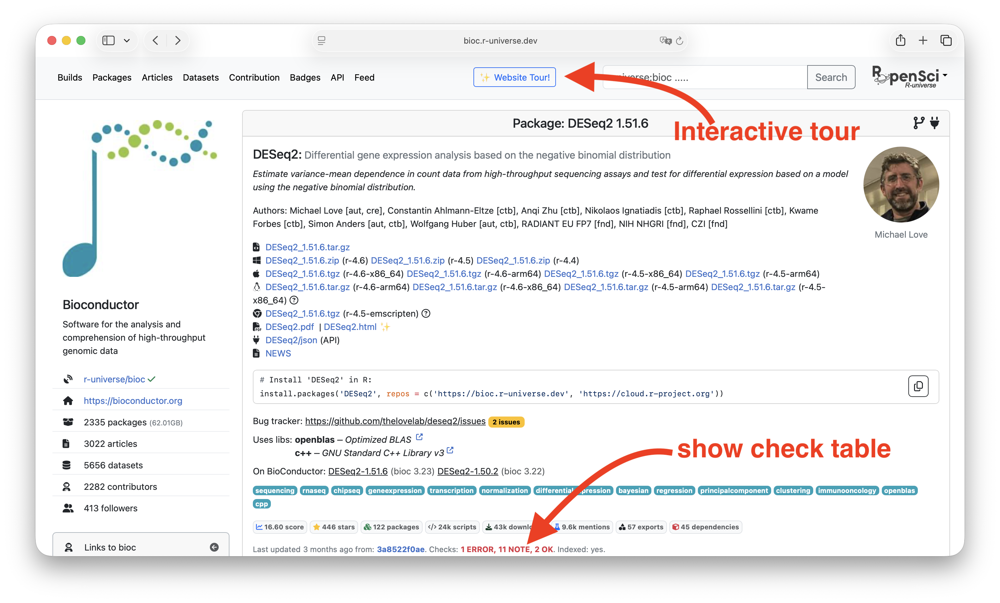
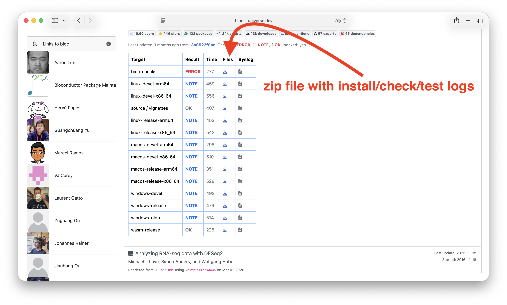

Over the past year, R-universe has been collaborating with Bioconductor to gradually modernize parts of its infrastructure, while accommodating the project’s scale, governance, and established workflows.

The goal is to offload much of the building and checking work to a common infrastructure on R-universe, and synchronize the binaries and results back to Bioconductor. Package maintainers and curators can use the R-universe dashboard and APIs to monitor package health and identify problems.

This page has some information specifically for Bioconductor users on the current ideas and how you can get started with R-universe.


## Package status information

We currently operate two dedicated R-universe instances for both Bioconductor branches:

 - __Bioc devel__: https://bioc.r-universe.dev
 - __Bioc release__: https://bioc-release.r-universe.dev

These universes integrate directly with Bioconductor’s existing Git infrastructure and provide continuous builds for packages in both branches. The binaries and check results as shown on R-universe eventually get mirrored and published on Bioconductor.

Information about each package is available on `https://bioc.r-universe.dev/{pkgname}`, for example https://bioc.r-universe.dev/DESeq2 shown below:

{fig-alt="Homepage of Bioconductor package"}

If this is the first time you visit R-universe, we recommend clicking the "Website Tour" button which will walk you through the most important information in 1 or 2 minutes.

## Check results

Package maintainers may mostly be interested in the check table, which shows the install and check results on different platforms. The `Result` column links to the GitHub "run" which shows detailed information about the builds, though it requires you are logged in with a GitHub account (which we very much recommend). 

The `File` column on the other hand links to a zip file which contains the install/check/test logs for each platform, and can be downloaded without a GitHub account. 

{fig-alt="Table with check results of a Bioconductor package"}


One thing you may notice, is that R-universe builds and checks R packages on multiple versions of R, as is common practice on CRAN and most other package repositories. This is different from what Bioconductor users may be used to, but there are good reasons, see the section below.

It is also possible to link directly to this check table, e.g. https://bioc.r-universe.dev/DESeq2#checktable.


## On R version compatibility

Bioconductor traditionally assumes a specific version of R for each version of the package. However we still recommend __not__ put unnecessary version constraints like `R > 4.6` in your package DESCRIPTION file, and instead try to make the package work at least with the `release` and `devel` version of R.

Doing so will smoothen the transition because many pieces of the build infrastructure use the current R `release` version to render components or calculate metrics to get thing published. If your package uses newly introduced R API's from R-devel, we recommend adding a [backport as explained in WRE](https://cran.r-project.org/doc/manuals/r-devel/R-exts.html#Some-backports) to make it also work with r-release. Feel free to reach out if you could use some help with this!

In addition to easing the build process, avoiding unnecessary R version restrictions can make your work more useful to the greater R community, as packages from other repositories could depend on your package, but without limiting their users to a given version of R.


## Debugging the CI

If you develop your package on GitHub, it is possible to the exact same workflow from your own GitHub repository. This allows you to test or debug the build and check process on your R package, exactly as it will happen on R-universe, but without actually deploying to https://r-universe.dev.


```yaml
name: Test R-universe

on:
  push:
  pull_request:

jobs:
  build:
    name: R-universe testing
    uses: r-universe-org/workflows/.github/workflows/build.yml@v3
    with:
      universe: bioc
```

Simply create a file `.github/workflows/r-universe.yml` in your git repository and copy the content above. See this [blog post](https://ropensci.org/blog/2026/01/03/r-universe-workflows/) for more details.

## Questions and suggestions

For questions, suggestions, and bug reports, please use our [issue tracker](https://github.com/r-universe-org/help/issues) or [discussion forum](https://github.com/orgs/r-universe-org/discussions).


